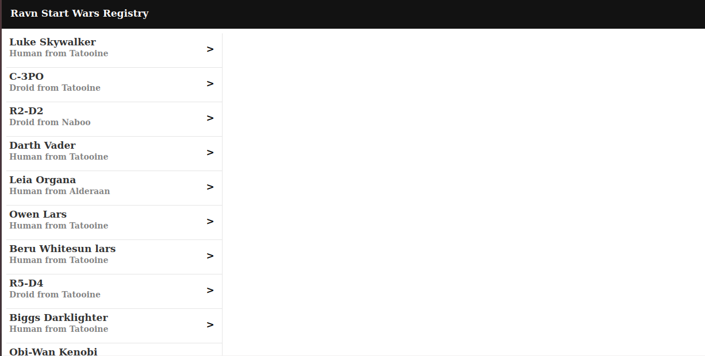

# Ravn GraphQL Challenge V2 - Star Wars GraphQL API
This is a Web-app  will help you to find all the characters from Star Wars with they name, species and homeworld and if you want more data about then only need make click over the chararcter
***
## Get started
``` bash
# clone repository
git clone https://github.com/mairelis-montilla/Ravn-Challenge-V2-mairelis.git
# install dependencies
npm install

# serve with hot reload at localhost:8080
npm run dev

# build for production with minification
npm run build
```
***
## Technologies used
  *  Vue.js
  * Apollo Client - GraphQL
  * CSS
  * HTML
  * Javascript
***
**Error**

**Lazy load**

**All people**

**Card info**
